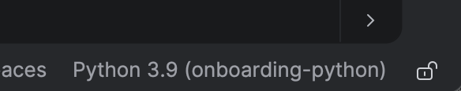
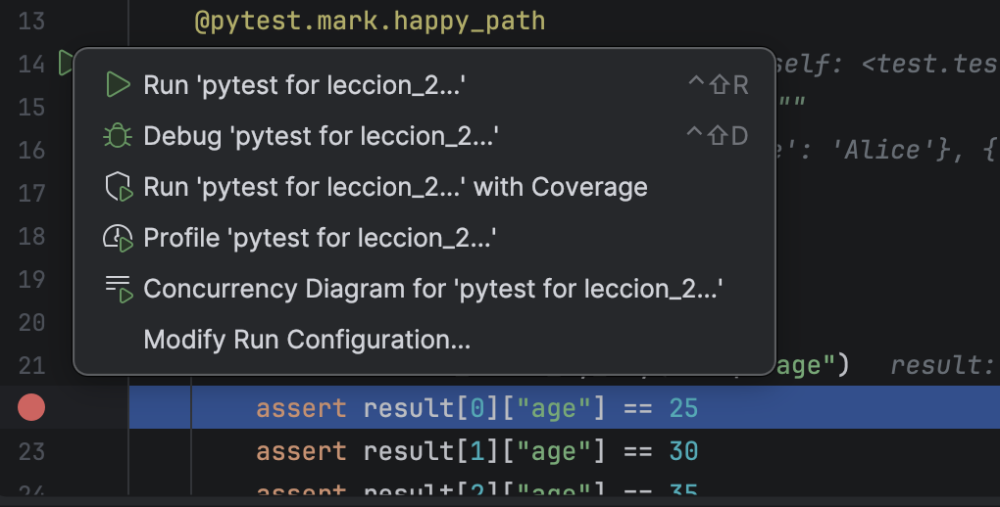
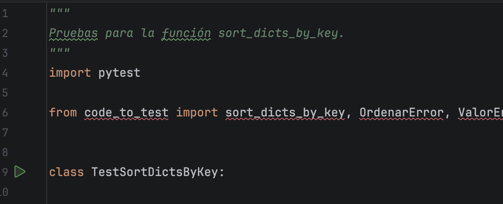

# Objetivos

Al final de esta lección, tú vas a:

1. Descargar un Entorno de Desarrollo Integrado y comprender qué es.
2. Fork (copiar) este repositorio.
3. Identificar y Entender variables, funciones, y excepciones.
4. Probar y depurar un programa.
5. Evaluar soluciones que ya existen.

# Entorno de Desarrollo Integrado

Los entornos de desarrollo integrados (IDEs) son editores de texto con herramientas que te permiten a probar y depurar tu codigo en la misma aplicación.

Por su simplicidad a demonstrar depurar nosotros podemos usar [PyCharm](https://www.jetbrains.com/pycharm/download/?section=mac),
pero [VsCode](https://code.visualstudio.com/) es una opición más general.  VsCode es de código abierto y por eso [Cursor](https://cursor.com/) es hecho encima de VsCode con más funciones de inteligencia artificial.  [Jupyter Notebook](https://jupyter.org/) es una mejor opción para trabajar con datos cuando quieres crear visualizaciones sobre las relaciones entre ellos.


PyCharm crea un entorno virtual por cada proyecto abre.  Pero, puedes cambiar el Python y digas PyCharm a usar calquier entorno virtual. Aprieta Python debajo y a la derecha del texto.


Entonces elige 'Add New Interpreter'>'Select Existing' y en 'Python Path' elige el binario de python en la carpeta de tu entorno virtual.


Necesitas instalar los requisitos en el etorno virtual de IDE para correr las pruebas.  Hazlo de la misma manera en la lección uno.  Recuerda, es muy importante que los requistos estén en el etorno virtual que se muestra debajo y a la derecha del texto.

Después de instalarlos.


En la carpeta 'sample/test' hay test_sort_dicts.py.  En el margen hay un botón verde.  Círculos rojos están en el margen también.  Puedes poner un círculo en una línea a decir PyCharm a perar en está línea y demonstrar los valores de los variables y la pila de llamadas por las funciones del programa.

¿Qué es un variable?  Es algo que tiene un valor.  En Python creas un variable como:

    variable="esto es el valor de mi variable"

¿Qué es una función? Es algo que tiene entradas y salidas.  Lo que hace durante de la función a generar salidas por las entradas está en la pila de llamadas.  Si un función llama un otra función pone la en la pila de llamadas.  Un programa está completo cuando nada más está en la pila.  En python creas una función como:

```
def func(entrada):
    print("pon print en la pila")
    return salida
```

# Apriétalo el Botón

Apriétalo el botón verde a lado de `class TestSortDictsByKey`.



¿Qué pruebas tienen éxito? ¿Qué pruebas fallan?

__Tu misión, si decides aceptarla es arreglar el código para que todas pruebas se ejecuten con éxito.__

Después súbelo a tu fork.